# 802.11 Study Guide

Frequency bands, how RF moves through a building, how devices take turns on the air, what happens between "tap SSID" and "connected", how WPA2 and WPA3 protect the link, and how 802.11r makes roaming fast. Covers Wi-Fi 4 → Wi-Fi 7.

**Bands:** 🟧 2.4 GHz · 🟦 5 GHz · 🟪 6 GHz

## Contents

0. [The standards at a glance](#0-the-standards-at-a-glance)
1. [Frequency bands: 2.4, 5 and 6 GHz](#1-frequency-bands-24-5-and-6-ghz)
2. [How Wi-Fi propagates](#2-how-wi-fi-propagates)
3. [Frames and medium access (CSMA/CA)](#3-frames-and-medium-access-csmaca)
4. [Associating to an access point](#4-associating-to-an-access-point)
5. [Security: WPA2 and WPA3](#5-security-wpa2-and-wpa3)
6. [Fast roaming with 802.11r](#6-fast-roaming-with-80211r)
7. [Numbers to memorize](#7-numbers-to-memorize)
8. [Self-test](#8-self-test)

---

## 0. The standards at a glance

802.11 is the IEEE standard for wireless LANs. Each letter suffix is an *amendment* that added a new physical layer or feature; the Wi-Fi Alliance later gave the big ones consumer names (Wi-Fi 4, 5, 6…). Knowing which amendment runs on which band answers a surprising number of exam questions.

| Amendment | Name | Year | Band(s) | Max rate | Key technology |
|---|---|---|---|---|---|
| `802.11` | — | 1997 | 2.4 | 2 Mbps | FHSS / DSSS |
| `802.11b` | — | 1999 | 2.4 | 11 Mbps | HR-DSSS (CCK) |
| `802.11a` | — | 1999 | 5 | 54 Mbps | OFDM |
| `802.11g` | — | 2003 | 2.4 | 54 Mbps | ERP-OFDM (OFDM on 2.4 GHz, backward-compatible with b) |
| `802.11n` | Wi-Fi 4 | 2009 | 2.4 / 5 | 600 Mbps | MIMO (up to 4 spatial streams), 40 MHz channels |
| `802.11ac` | Wi-Fi 5 | 2013 | **5 only** | 6.9 Gbps | 256-QAM, 80/160 MHz, downlink MU-MIMO |
| `802.11ax` | Wi-Fi 6 / 6E | 2019 | 2.4 / 5 / 6\* | 9.6 Gbps | OFDMA, 1024-QAM, BSS coloring, Target Wake Time, UL + DL MU-MIMO |
| `802.11be` | Wi-Fi 7 | 2024 | 2.4 / 5 / 6 | ~46 Gbps | 320 MHz channels, 4096-QAM, Multi-Link Operation (MLO) |

\* "Wi-Fi 6E" is simply 802.11ax operating in the 6 GHz band. Max rates are theoretical PHY rates, not real-world throughput.

> [!WARNING]
> **Common trap:** 802.11ac is **5 GHz only**. A "dual-band AC router" is running 802.11n on its 2.4 GHz radio.

---

## 1. Frequency bands: 2.4, 5 and 6 GHz

Wi-Fi uses **unlicensed** spectrum: anyone can transmit without a license, as long as they follow the regulator's rules on channels and power (the FCC in the US, ETSI in Europe). That's why available channels differ by country and why APs are configured with a country code.

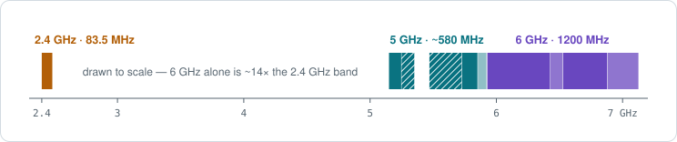

*Drawn to scale. Hatched 5 GHz segments (U-NII-2A and U-NII-2C) require DFS. The faint sliver at the top of 5 GHz is U-NII-4, opened in the US in 2020 with limited device support.*

### 🟧 2.4 GHz — the long-range, crowded band

- **Range:** 2.400–2.4835 GHz, part of the ISM (Industrial, Scientific, Medical) band — shared with microwave ovens, Bluetooth, Zigbee, baby monitors and cordless phones.
- **Channels:** 14 defined, spaced only **5 MHz** apart, but each is ~**20 MHz** wide (22 MHz for legacy DSSS). US uses 1–11; most of the world 1–13; channel 14 is Japan-only and 802.11b-only.
- **Center frequency** = 2407 + 5 × channel (MHz). Channel 1 = 2.412, 6 = 2.437, 11 = 2.462 GHz.
- Only **three non-overlapping channels: 1, 6 and 11**. 40 MHz channels are effectively unusable here because only one fits.
- **Strengths:** best range and wall penetration; every Wi-Fi device supports it. **Weaknesses:** congestion, non-Wi-Fi interference, low capacity.

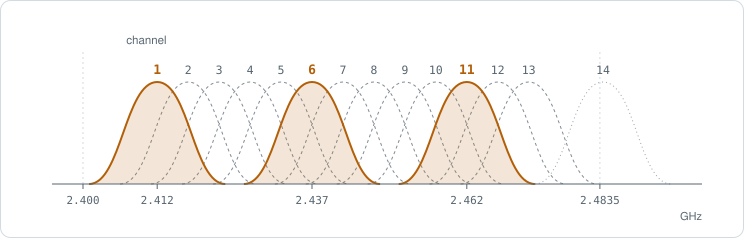

*Each curve is one channel's ~22 MHz footprint. Channels 1, 6 and 11 (solid) sit far enough apart not to overlap; every channel in between overlaps its neighbours. Channel 14 (dotted) is Japan-only.*

> [!TIP]
> **CCI vs ACI.** **Co-channel interference (CCI)**: two APs on the *same* channel. Devices hear each other and take turns (CSMA/CA), so it costs airtime but stays orderly. **Adjacent-channel interference (ACI)**: APs on *overlapping* channels (e.g. 1 and 3). They can't decode each other, so it's just noise and corrupts frames. ACI is worse, which is why you stick to 1/6/11.

### 🟦 5 GHz — the workhorse band

5 GHz is split into **U-NII** (Unlicensed National Information Infrastructure) sub-bands with different rules. Channel numbers step by 4 for 20 MHz channels, and **center frequency = 5000 + 5 × channel** (MHz), so channel 36 = 5.180 GHz.

| Sub-band | Frequency (GHz) | Channels | Rules |
|---|---|---|---|
| `U-NII-1` | 5.150–5.250 | 36–48 | No DFS. Always available. |
| `U-NII-2A` | 5.250–5.350 | 52–64 | **DFS** + TPC required |
| `U-NII-2C` | 5.470–5.725 | 100–144 | **DFS** + TPC required (a.k.a. U-NII-2 Extended) |
| `U-NII-3` | 5.725–5.850 | 149–165 | No DFS. Historically allowed higher power. |
| `U-NII-4` | 5.850–5.925 | 169–177 | Opened by the FCC in 2020; limited client support. |

- **25 non-overlapping 20 MHz channels** in the US (U-NII-1 through U-NII-3, counting DFS channels).
- **DFS (Dynamic Frequency Selection):** these frequencies are shared with weather and military radar. Before using a DFS channel an AP must listen for radar for **60 seconds** (Channel Availability Check). If it detects radar it must leave within 10 seconds and avoid that channel for 30 minutes — clients get kicked to a new channel.
- **TPC (Transmit Power Control):** AP reduces power when full power isn't needed, limiting interference with radar.
- **Channel bonding:** 40, 80 and 160 MHz channels combine adjacent 20 MHz channels for more throughput per client.
- **Tradeoff vs. 2.4:** less range and weaker wall penetration, but far more channels and much less interference.

### 🟪 6 GHz — the clean-slate band (Wi-Fi 6E and 7)

- **Range:** 5.925–7.125 GHz — **1200 MHz** of new spectrum in the US (U-NII-5 through U-NII-8). Europe (ETSI) opened only the lower 500 MHz (5.945–6.425 GHz).
- **Greenfield:** only 802.11ax (6E) and 802.11be (Wi-Fi 7) devices can use it. No legacy b/g/n/ac clients means no backward-compatibility overhead slowing the air down.
- **Channels:** numbered 1, 5, 9 … 233; center = 5950 + 5 × channel (MHz). 59 × 20 MHz, 29 × 40, 14 × 80, 7 × 160, and 3 non-overlapping 320 MHz channels (Wi-Fi 7).
- **Discovery:** clients don't blindly probe all 59 channels. APs advertise their 6 GHz radio in 2.4/5 GHz beacons (**Reduced Neighbor Report**), and clients scan 15 **Preferred Scanning Channels** (PSCs: 5, 21, 37 … every 80 MHz).
- **Power classes:** *Low Power Indoor* (LPI, no coordination needed), *Standard Power* (outdoor/higher power, must check an **AFC** — Automated Frequency Coordination — database to protect licensed microwave links), and *Very Low Power* (portable devices).
- **Security is mandatory:** WPA3 or Enhanced Open (OWE) only, with Protected Management Frames. **No WPA2, no open networks, no WPA2/WPA3 transition mode.**

### Comparing the three bands

| | 🟧 2.4 GHz | 🟦 5 GHz | 🟪 6 GHz |
|---|---|---|---|
| **Spectrum** | 83.5 MHz | ~580 MHz (US) | 1200 MHz (US) |
| **Wavelength** | ~12.3 cm | ~5.5 cm | ~4.6 cm |
| **Range / penetration** | Best | Medium | Shortest |
| **Congestion** | High | Moderate | Low |
| **Amendments** | b, g, n, ax, be | a, n, ac, ax, be | ax (6E), be |
| **Security allowed** | WPA2 or WPA3 | WPA2 or WPA3 | WPA3 / OWE only |

#### Non-overlapping channels by width

| Width | 🟧 2.4 GHz | 🟦 5 GHz (US) | 🟪 6 GHz (US) |
|---|---|---|---|
| 20 MHz | 3 | 25 | 59 |
| 40 MHz | 1 (avoid) | 12 | 29 |
| 80 MHz | — | 6 | 14 |
| 160 MHz | — | 2 | 7 |
| 320 MHz | — | — | 3 (Wi-Fi 7) |

> [!TIP]
> Wider channels give each client more throughput but leave fewer channels to reuse across APs, which increases co-channel interference. Dense enterprise designs usually run 20 or 40 MHz on 5 GHz; 6 GHz is what makes 80/160 MHz practical at scale.

---

## 2. How Wi-Fi propagates

Wi-Fi is an electromagnetic wave. Its **wavelength** is λ = c ÷ f (speed of light over frequency). Higher frequency means shorter wavelength, more loss through obstacles, and less energy picked up by the receiving antenna at a given distance. That single relationship explains most of the band tradeoffs above.

| Frequency | Wavelength | Relative size |
|---|---|---|
| 🟧 2.44 GHz | **12.3 cm** | `████████████` |
| 🟦 5.5 GHz | **5.5 cm** | `█████▌` |
| 🟪 6.5 GHz | **4.6 cm** | `████▌` |

### The five RF behaviours

| | Behaviour | What happens | Examples |
|---|---|---|---|
| 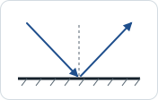 | **Reflection** | Bounces off a smooth surface much larger than the wavelength. The main cause of multipath indoors. | Metal, glass, mirrors, water, filing cabinets, elevators |
| 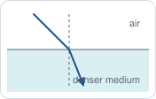 | **Refraction** | Bends as it passes between media of different density, changing direction. | Glass, air layers at different temperatures (matters on long outdoor links) |
| 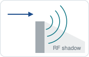 | **Diffraction** | Bends around the edge of an obstacle, partially filling the shadow behind it. Longer wavelengths (2.4 GHz) diffract better. | Building corners, pillars, hills |
| 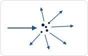 | **Scattering** | Hits many objects about the size of the wavelength or smaller and splits into many weak reflections in all directions. | Chain-link fences, foliage, rough stone, dust, rain |
| 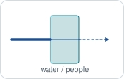 | **Absorption** | The material converts RF energy into heat, so less comes out the other side. Higher frequencies are absorbed more. | Human bodies, water, concrete, dense wood, drywall (a little) |

**Attenuation** is the umbrella term for loss of signal strength. Absorption through materials is one source; the spreading of the wave over distance (free space path loss) is the other.

### Free space path loss (FSPL)

Even with nothing in the way, signal weakens with distance because energy spreads over a growing sphere (the inverse-square law).

```
FSPL (dB) = 20·log10(d in m) + 20·log10(f in MHz) − 27.55
```

| Distance | 🟧 2.44 GHz | 🟦 5.5 GHz | 🟪 6.5 GHz |
|---|---|---|---|
| 1 m | 40.2 dB | 47.3 dB | 48.7 dB |
| 10 m | 60.2 dB | 67.3 dB | 68.7 dB |
| 100 m | 80.2 dB | 87.3 dB | 88.7 dB |

- **6 dB rule:** doubling the distance adds ~6 dB of loss (¼ the power). Halving it gains 6 dB.
- At the same distance, 5 GHz loses ~7 dB more than 2.4 GHz, and 6 GHz ~8.5 dB more — before any walls.
- Strictly, the frequency term reflects the receiving antenna: a same-type antenna is physically smaller at higher frequency, so it captures less energy.

### Multipath

Reflections make copies of the signal arrive at the receiver over different paths, at slightly different times and phases. The time spread between the first and last copy is the **delay spread**.

- **In phase** → copies add up (*upfade*). **Out of phase** → they partially cancel (*downfade*). **180° out** → near-total cancellation (*nulling*).
- Late copies can overlap the next symbol → **inter-symbol interference** and corrupted frames.
- For older SISO radios (a/b/g), multipath was a problem. **802.11n and later use MIMO to exploit it**: different paths carry independent spatial streams. OFDM's guard interval absorbs delay spread.

### Material attenuation (rough values)

| Material | Loss at 2.4 GHz | Notes |
|---|---|---|
| Drywall / plasterboard | ~3 dB | Cubicle walls less |
| Clear glass window | ~3 dB | Low-E / metallic-tinted glass can exceed 20 dB |
| Wooden door | ~3–4 dB | |
| Brick wall | ~6–10 dB | |
| Concrete wall | ~10–15 dB | Rebar and thickness push it higher |
| Metal / elevator shaft | 20+ dB | Effectively a reflector, not a wall |

*Ballpark figures only — real walls vary widely. Expect several dB more at 5 and 6 GHz.*

### Measuring signal: dB, dBm and SNR

- **dB** is a relative change. Rule of 3s and 10s: **+3 dB = double** the power, −3 dB = half; **+10 dB = ×10**, −10 dB = ÷10.
- **dBm** is absolute power referenced to 1 mW: 0 dBm = 1 mW, 10 dBm = 10 mW, **20 dBm = 100 mW**, 30 dBm = 1 W. Received Wi-Fi signals are tiny, so they're negative (−65 dBm).
- **dBi** is antenna gain vs. a theoretical isotropic radiator; **dBd** is vs. a dipole. dBi = dBd + 2.14.
- **SNR** = signal − noise floor. −65 dBm signal over a −95 dBm noise floor = 30 dB SNR. Aim for 25 dB+ for voice; below ~10 dB the link barely works.
- **EIRP** (what actually leaves the antenna) = transmit power − cable loss + antenna gain. Example: 20 dBm − 2 dB + 6 dBi = 24 dBm (~250 mW).

| Received signal (RSSI) | What it means |
|---|---|
| −30 dBm | Excellent — you're next to the AP |
| −67 dBm | **Design target** for voice, video and enterprise coverage |
| −70 dBm | Reliable for web and email |
| −80 dBm | Connects, but slow and unreliable |
| −90 dBm | At the noise floor — unusable |

### Antennas and line of sight

- **Omnidirectional** (dipole): 360° horizontal "donut" pattern. Higher-gain omnis flatten the donut — more reach sideways, less coverage directly below.
- **Semi-directional** (patch, panel, Yagi): aim coverage down a hallway or across a courtyard.
- **Highly directional** (parabolic dish, grid): point-to-point building links.
- Gain doesn't create power; it *focuses* it in one direction at the expense of others.
- **Fresnel zone:** the football-shaped area around a point-to-point link's straight line. Keep at least **60% of the first Fresnel zone clear** (no more than 40% blocked). Visual line of sight ≠ RF line of sight.

---

## 3. Frames and medium access (CSMA/CA)

Everything sent over Wi-Fi is a **frame**. The 802.11 MAC layer defines what frames look like, what kinds exist, and the rules (CSMA/CA) that let many devices share one half-duplex radio channel without talking over each other.

### The MAC frame

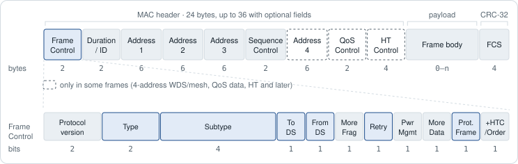

*Fields in dashed boxes appear only in some frames. Highlighted fields are the ones this guide keeps coming back to.*

- **Frame Control** tells the receiver what it's looking at: the **Type** and **Subtype**, the **To DS / From DS** direction bits, **Retry** (this is a resend), **Power Management** (the sender is about to sleep), **More Data** (the AP has more buffered for a sleeping client), and **Protected Frame** (the body is encrypted).
- **Duration/ID** says how many microseconds the medium will stay busy after this frame (for the ACK, for example). Every station that hears it sets its **NAV** from this value; see CSMA/CA below.
- **Addresses 1–3** (and 4 for bridges and mesh) identify the receiver, transmitter, BSSID and end points. Their meaning depends on the To DS / From DS bits.
- **Sequence Control** holds a sequence number and fragment number, so a receiver can discard duplicates created by retries.
- **QoS Control** carries the traffic priority (TID) for WMM. **HT Control** carries link-adaptation information for 802.11n and later.
- **FCS** is a CRC-32 over the whole frame. A frame that fails it is silently dropped and not acknowledged, so the sender retries.

### The three frame types

| Type (bits) | Purpose | Common subtypes |
|---|---|---|
| **Management** `00` | Find, join, leave and manage a network | `Beacon`, `Probe Request/Response`, `Authentication`, `Deauthentication`, `Association` / `Reassociation Request/Response`, `Disassociation`, `Action` |
| **Control** `01` | Help deliver other frames; carry no data | `ACK`, `RTS`, `CTS`, `Block Ack`, `Block Ack Request`, `PS-Poll`, `Trigger` (Wi-Fi 6) |
| **Data** `10` | Carry user traffic (and some signalling) | `Data`, `QoS Data`, `Null`, `QoS Null` |

Type `11` is an extension type used by 802.11ad (60 GHz) and rarely shows up on exams.

- **Management frames are sent unencrypted.** Anyone can read beacons, probes, authentication and association frames. With PMF, deauthentication, disassociation and "robust" Action frames are integrity-protected, but beacons and probes still aren't encrypted.
- **Action frames** are the general-purpose management frame: they carry 802.11k neighbor reports, 802.11v transition requests, 802.11r over-the-DS messages, Block Ack setup, channel switch announcements and more.
- **Null data frames** carry no payload. Clients use them to tell the AP they're going to sleep or waking up (the Power Management bit), and to probe the link.
- **Unicast frames are acknowledged; broadcast and multicast frames are not.** With no ACK they can't be retried, so they're sent at a basic (low) data rate that every client can decode.

### Addresses: To DS and From DS

The "DS" is the distribution system, the wired network behind the APs. **Address 1 is always the receiver and Address 2 is always the transmitter**; the other addresses fill in who the frame is really from or for.

| To DS | From DS | Direction | Address 1 | Address 2 | Address 3 | Address 4 |
|---|---|---|---|---|---|---|
| 0 | 0 | Management/control frames, or ad hoc (IBSS) data | Destination | Source | BSSID | — |
| 1 | 0 | Client → AP (toward the wired side) | BSSID (AP) | Source (client) | Destination | — |
| 0 | 1 | AP → client | Destination (client) | BSSID (AP) | Source | — |
| 1 | 1 | AP ↔ AP bridge (WDS / mesh) | Receiving AP | Transmitting AP | Destination | Source |

> [!TIP]
> When a laptop sends to a server on the wired LAN, the frame is addressed over the air to the **AP** (Address 1 = BSSID), but Address 3 holds the **server's** MAC. The AP uses Address 3 to build the Ethernet frame it forwards onto the wire.

### CSMA/CA: taking turns on the air

Ethernet switched away from shared media long ago, but a Wi-Fi channel is still one shared medium. It's also **half duplex**: a radio can't listen while it transmits, because its own signal drowns everything else. So Wi-Fi can't use Ethernet's CSMA/CD (*collision detection*). It uses **CSMA/CA, carrier sense multiple access with collision avoidance**: try hard to avoid collisions, and treat a missing ACK as the only sign that one happened.

1. **Listen (carrier sense).** The medium counts as busy if *either* check says so:\
   **Physical carrier sense (CCA, clear channel assessment):** a decodable Wi-Fi preamble at about **−82 dBm** or stronger (20 MHz channel), or any energy at about **−62 dBm** or stronger, such as a microwave oven.\
   **Virtual carrier sense (NAV, network allocation vector):** a countdown timer each station sets from the Duration field of frames it overhears. While the NAV is running, the station treats the medium as busy without even listening.
2. **Wait an interframe space.** The medium must stay idle for a **DIFS** (or, for QoS traffic, the access category's **AIFS**).
3. **Back off.** Pick a random number of slots between 0 and the **contention window (CW)**, and count down one per idle slot. If the medium goes busy, **freeze** the counter and resume after the next DIFS. Transmit at zero.
4. **Get acknowledged.** The receiver replies with an ACK after a **SIFS**. No ACK means the sender assumes a collision: it sets the Retry bit, **doubles its CW** (up to CWmax) and tries again, and drops the frame after its retry limit.

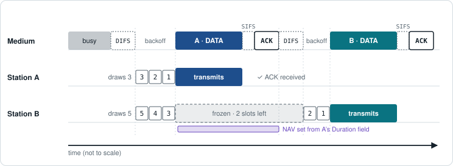

*Both stations wait DIFS, then count down. A drew 3 slots and transmits first; the AP ACKs after SIFS. B drew 5, so it freezes with 2 slots left and sets its NAV from A's Duration field, then finishes its countdown after the next DIFS. Freezing rather than restarting is what keeps it fair: B keeps its place in line.*

#### Timing values

| Parameter | OFDM, 5 GHz (a/n/ac/ax) | 802.11b (DSSS) |
|---|---|---|
| Slot time | 9 µs | 20 µs |
| SIFS | 16 µs | 10 µs |
| PIFS = SIFS + 1 slot | 25 µs | 30 µs |
| DIFS = SIFS + 2 slots | 34 µs | 50 µs |
| CWmin → CWmax | 15 → 1023 | 31 → 1023 |

- **SIFS is the shortest wait**, so frames that finish an exchange already in progress (ACK, CTS, Block Ack, the data after a CTS) always go before anyone waiting a DIFS can jump in.
- **PIFS** gives the AP priority access for a few special cases, such as a channel switch announcement.
- **The contention window doubles** after each failed attempt: 15 → 31 → 63 → 127 → 255 → 511 → 1023. It resets to CWmin after a success.
- On 2.4 GHz, OFDM (g/n/ax) uses a 10 µs SIFS plus a 6 µs signal extension, and the 9 µs short slot only when no 802.11b stations are present.

### QoS: WMM and EDCA

**WMM** (the Wi-Fi Alliance's name for 802.11e **EDCA**) runs CSMA/CA with four **access categories**. Higher-priority traffic waits a shorter AIFS and draws from a smaller contention window, so it wins the medium more often. It isn't reserved bandwidth, just better odds.

| Access category | 802.1p priority | AIFSN | AIFS (5 GHz) | CWmin → CWmax | TXOP limit |
|---|---|---|---|---|---|
| **Voice** (AC_VO) | 6, 7 | 2 | 34 µs | 3 → 7 | 1.504 ms |
| **Video** (AC_VI) | 4, 5 | 2 | 34 µs | 7 → 15 | 3.008 ms |
| **Best effort** (AC_BE) | 0, 3 | 3 | 43 µs | 15 → 1023 | one frame exchange |
| **Background** (AC_BK) | 1, 2 | 7 | 79 µs | 15 → 1023 | one frame exchange |

*Default WMM values for client stations; APs use slightly different ones. AIFS = SIFS + AIFSN × slot time.*

- **TXOP (transmit opportunity):** once a station wins the medium it may send a burst of frames for up to the TXOP limit without contending again.
- **WMM is mandatory for 802.11n and later.** With WMM turned off, 802.11n/ac/ax devices fall back to legacy 54 Mbps rates.

### Hidden nodes and RTS/CTS

Carrier sense only works if stations can hear each other.

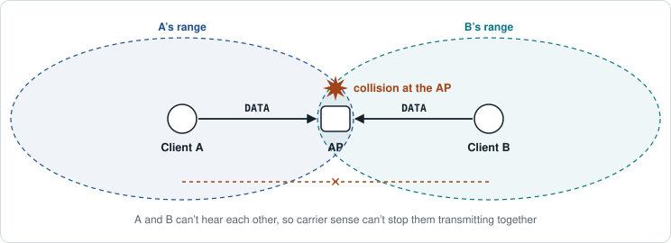

The **hidden node problem**: A and B both reach the AP, but not each other. Each senses an idle medium, both transmit, and the frames collide *at the AP*. Neither sender can tell; they just miss their ACKs, back off and often collide again.

**RTS/CTS** fixes it by having the AP announce the reservation, since everyone can hear the AP:

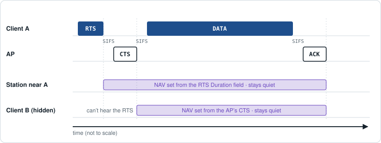

1. A sends a short **RTS** (request to send) whose Duration covers the whole exchange.
2. The AP replies with a **CTS** (clear to send), carrying a Duration that covers the rest of the exchange.
3. Everyone who hears *either* frame sets its NAV, including hidden client B, which hears the AP's CTS. A then sends its data and gets its ACK without interference.

- **The cost:** two extra frames and two extra SIFS for every exchange. Devices therefore use RTS/CTS selectively, for example above an **RTS threshold** (frame size), after repeated failures, or before a large aggregated frame.
- **CTS-to-self:** a station sends a CTS addressed to itself to reserve the medium without an RTS. It's used for **protection mode**: when 802.11b stations are present, OFDM stations send a CTS-to-self at a DSSS rate the b stations can decode, so they set their NAV. This overhead is one reason to disable 802.11b rates.
- The mirror-image problem is the **exposed node**: a station defers unnecessarily because it hears a transmission that wouldn't actually interfere with its own.

### Efficiency: aggregation and Block Ack

Every transmission pays a fixed cost in time (DIFS, backoff, preamble, SIFS and an ACK) no matter how fast the data rate is. At hundreds of Mbps that overhead would dominate, so 802.11n added aggregation:

- **A-MPDU:** many frames sent back to back in one transmission. The receiver answers with a single **Block Ack** whose bitmap shows which subframes arrived, and only the missing ones are resent.
- **A-MSDU:** several packets packed inside one frame with one FCS. It's more efficient, but one bit error ruins the whole frame.

### Airtime: why slow clients hurt everyone

- **CSMA/CA gives each station an equal chance to transmit, not equal airtime.** A frame sent at 1 Mbps occupies the channel hundreds of times longer than the same frame at several hundred Mbps, and everyone else waits.
- **Disabling low legacy rates** (1, 2, 5.5 and 11 Mbps) and raising the minimum basic rate shortens beacons and broadcasts, avoids protection mode, and encourages "sticky" clients to roam to a closer AP.
- **Wi-Fi 6 changes the model:** with **OFDMA**, the AP splits a channel into resource units and uses **Trigger** frames to schedule several clients at once instead of making them contend. **BSS coloring** tags frames with a color per BSS, so a station can apply a higher CCA threshold to a distant same-channel network (spatial reuse) instead of deferring to it.

> [!WARNING]
> **Common trap:** Wi-Fi is half duplex and shared. Only one transmission happens on a channel at a time (per resource unit with OFDMA), so adding clients divides the airtime; it doesn't add capacity.

> [!TIP]
> **CSMA/CA in one line:** listen (CCA + NAV) → wait DIFS/AIFS → random backoff (freeze when busy) → transmit → ACK after SIFS. No ACK means a collision is assumed: double the CW and retry.

---

## 4. Associating to an access point

Joining a secured Wi-Fi network happens in stages. The first three are unencrypted management frames (see [section 3](#3-frames-and-medium-access-csmaca)) that anyone nearby can see. Real authentication and key creation happen afterwards, in 802.1X/EAP (enterprise) and the 4-way handshake.

1. **Discovery (scanning)** — `Beacon` · `Probe Request` · `Probe Response`\
   **Passive:** the client listens on each channel for Beacons, which APs send every **102.4 ms** by default (100 TU). **Active:** the client sends a Probe Request (for a named SSID or a wildcard) and APs reply with Probe Responses.\
   Beacons and probe responses advertise SSID, BSSID (the AP radio's MAC address), supported rates and capabilities, and the **RSN Information Element (RSNE)** that lists the ciphers and authentication methods (PSK, SAE, 802.1X) the network accepts.

2. **802.11 authentication** — `Authentication (req)` · `Authentication (resp)`\
   For WPA2 this is **Open System** authentication: a two-frame formality that verifies nothing. (WEP's "Shared Key" auth here is obsolete.) **WPA3-Personal is the exception:** the **SAE Commit and Confirm** exchange happens in these Authentication frames, and this is where the password is actually checked.

3. **Association** — `Association Request` · `Association Response`\
   The client states its capabilities and picks a cipher and auth method (its own RSNE). The AP replies with a status code and an **Association ID (AID)**. Roaming to another AP in the same network uses *Reassociation* Request/Response instead.

4. **802.1X / EAP** *(enterprise only)* — `EAPOL-Start` · `EAP-Request/Identity` · `…EAP method…` · `EAP-Success`\
   The AP (*authenticator*) relays EAP between the client (*supplicant*) and a RADIUS server (*authentication server*). When it succeeds, client and server both hold a **Master Session Key (MSK)**; the server hands it to the AP in the RADIUS Access-Accept. The first 256 bits become the PMK. See the [802.1X exchange diagram](#the-8021x-exchange-step-by-step-peap) in section 5.

5. **4-way handshake** — `EAPOL-Key M1` · `M2` · `M3` · `M4`\
   Proves both sides hold the same PMK — without sending it — and derives fresh encryption keys for this session. Detailed below.

6. **Encrypted data**\
   The 802.1X "controlled port" opens. Unicast frames are encrypted with the **TK**, broadcast/multicast with the **GTK**. Until now, the only data frames allowed were EAPOL.

#### The 802.11 state machine

| State 1 | State 2 | State 3 | State 4 |
|---|---|---|---|
| Unauthenticated, unassociated | Authenticated, unassociated | Associated — only EAPOL allowed while keys are pending | ✅ Keys established (RSNA) — port open |

### Where the PMK comes from

Everything in the 4-way handshake starts from the **Pairwise Master Key (PMK)**, which both sides already have before the handshake starts. How they got it depends on the security mode:

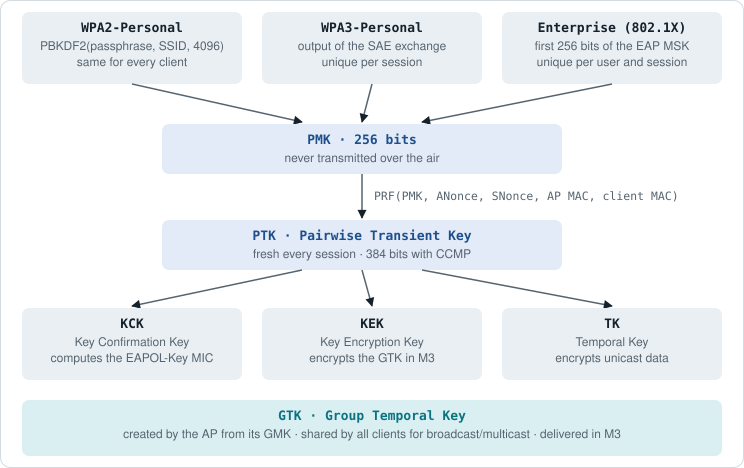

| Key | Full name | Job |
|---|---|---|
| **PMK** | Pairwise Master Key | 256 bits; never transmitted over the air |
| **PTK** | Pairwise Transient Key | Fresh for every session; split into three keys (384 bits total with CCMP) |
| **KCK** | Key Confirmation Key | Computes the **MIC** on EAPOL-Key frames |
| **KEK** | Key Encryption Key | Encrypts the **GTK** in message 3 |
| **TK** | Temporal Key | Encrypts **unicast data** |
| **GTK** | Group Temporal Key | Created by the AP (from its GMK) and shared by all clients to encrypt broadcast/multicast. Delivered in M3; rotated later with the 2-message Group Key Handshake. |

### The 4-way handshake, message by message

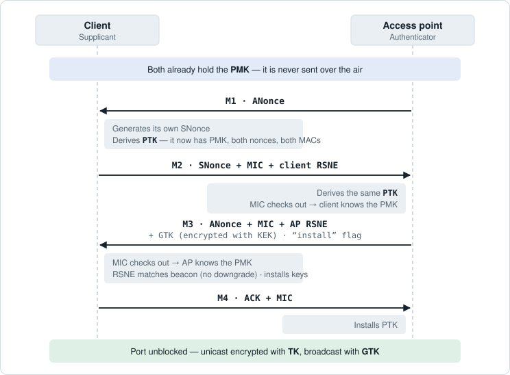

*Nonces are random numbers used once; ANonce comes from the Authenticator, SNonce from the Supplicant. Every message after M1 carries a MIC computed with the KCK, so tampering or a wrong key is detected.*

| Msg | Direction | Carries | Why |
|---|---|---|---|
| M1 | AP → Client | ANonce, replay counter | Gives the client the last piece it needs to derive the PTK. No MIC yet — there's no key to make one with. |
| M2 | Client → AP | SNonce, MIC, client's RSNE | AP can now derive the PTK. A valid MIC proves the client has the right PMK (i.e. the right password or EAP result). |
| M3 | AP → Client | ANonce, MIC, AP's RSNE, encrypted GTK | Proves the AP has the PMK too (mutual auth), delivers the group key, and lets the client check that security settings weren't downgraded. |
| M4 | Client → AP | MIC | Acknowledges. Both sides install keys and encrypted traffic begins. |

```
PTK = PRF(PMK, "Pairwise key expansion",
          Min(AA,SPA) ‖ Max(AA,SPA) ‖ Min(ANonce,SNonce) ‖ Max(ANonce,SNonce))
```

*AA = Authenticator (AP) MAC address · SPA = Supplicant (client) MAC address*

> [!TIP]
> **Why it matters.** Because the nonces are fresh every time, each session gets a new PTK even though the PMK stays the same. But M1 and M2 also hold everything an attacker needs to test WPA2-Personal password guesses offline — see the next section.

### Roaming shortcuts

Running this whole sequence, including full 802.1X, every time a client moves to another AP can take hundreds of milliseconds — enough to drop a call. PMK caching, OKC and 802.11r Fast BSS Transition shorten it. See [Fast roaming with 802.11r](#6-fast-roaming-with-80211r).

---

## 5. Security: WPA2 and WPA3

| 1997 · **WEP** ❌ | 2003 · **WPA** ❌ | 2004 · **WPA2** | 2018 · **WPA3** ✅ |
|---|---|---|---|
| RC4 with a 24-bit IV. Broken; crackable in minutes. | TKIP stopgap to run on WEP hardware. Deprecated. | 802.11i, AES-CCMP. Mandatory for Wi-Fi certification since 2006. | SAE, mandatory PMF, 192-bit enterprise mode. |

| | WEP | WPA | WPA2 | WPA3 |
|---|---|---|---|---|
| **Encryption** | RC4 | RC4 via TKIP | AES-CCMP (128-bit) | AES-CCMP-128; GCMP-256 in 192-bit mode |
| **Integrity** | CRC-32 | Michael MIC | CBC-MAC (in CCMP) | CBC-MAC / GMAC |
| **Personal auth** | Shared key | PSK | PSK | SAE |
| **Enterprise auth** | — | 802.1X/EAP | 802.1X/EAP | 802.1X/EAP (+ 192-bit) |
| **Forward secrecy** | No | No | No | Yes (SAE) |
| **PMF (802.11w)** | No | No | Optional | Required |
| **Verdict** | ❌ Broken | ❌ Deprecated | ⚠️ OK, strong passphrase | ✅ Use this |

### WPA2

#### WPA2-Personal (PSK)

- One passphrase for everyone: **8–63 ASCII characters** (or 64 hex digits). The PMK is derived with PBKDF2 using the SSID as salt and 4096 iterations.
- Encryption is **AES-CCMP**: AES in Counter mode for confidentiality plus CBC-MAC for integrity.

#### WPA2-Enterprise (802.1X/EAP)

Each user or device has its own credentials, checked by a RADIUS server, so every client ends up with a unique PMK and you can revoke one user without changing a shared password.

| EAP method | Client proves itself with | Server cert | Notes |
|---|---|---|---|
| `EAP-TLS` | Client certificate | Yes | Strongest; requires PKI to issue client certs. Required for WPA3 192-bit. |
| `PEAP` | Username + password (MSCHAPv2 inside a TLS tunnel) | Yes | Most common; only the server needs a certificate. |
| `EAP-TTLS` | Username + password (various inner methods) | Yes | Like PEAP, more flexible inner auth. |
| `EAP-FAST` | PAC (Protected Access Credential) | Optional | Cisco-developed alternative to certificates. |

#### The 802.1X exchange, step by step (PEAP)

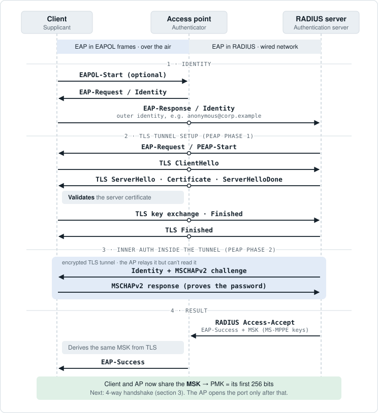

*A PEAP (MSCHAPv2) login. Dots on the AP's line mark EAP messages it relays unchanged between EAPOL and RADIUS. Simplified: PEAP also exchanges an inner success message and a result TLV before the Access-Accept.*

- **Three roles, two transports.** EAP travels inside **EAPOL** frames over the air (client ↔ AP) and inside **RADIUS** Access-Request / Access-Challenge messages on the wired side (AP ↔ server). The AP doesn't take part in the authentication; it just repackages EAP.
- **Before this starts** the client is already associated (state 3), and the AP drops every data frame except EAPOL.
- **Outer vs. inner identity.** The first Identity response is sent in the clear, so it can be anonymous (`anonymous@corp.example`), with just enough of a realm to route it to the right RADIUS server. The real username is sent only inside the encrypted tunnel.
- **Phase 1** builds a TLS tunnel between client and RADIUS server. This is the moment the client must **validate the server certificate** (see the trap below).
- **Phase 2** runs the inner method, MSCHAPv2 for PEAP, inside the tunnel. The AP relays it but can't read it.
- **EAP-TLS differs:** in phase 1 the client also sends *its own* certificate (plus a CertificateVerify proving it holds the private key). Both sides are authenticated by certificates, so there is no phase 2 and no password.
- **The result:** the server sends **Access-Accept** carrying EAP-Success and the **MSK** (in the MS-MPPE key attributes). It can also carry authorization, such as a VLAN assignment for this user. The AP forwards EAP-Success to the client, which derived the same MSK from the TLS session, and the 4-way handshake follows.
- **Failure:** a wrong password or rejected certificate gets **Access-Reject**, and the AP sends EAP-Failure.

> [!WARNING]
> **Common trap:** with PEAP/TTLS, clients **must validate the server certificate**. If they don't, an evil-twin AP with its own RADIUS server can collect usernames and password hashes.

#### WPA2 weaknesses

- **Offline dictionary attack:** capture M1 + M2 of a handshake (or just the PMKID in M1, no client needed) and test password guesses offline at GPU speed. Defence: long random passphrases (20+ characters), or move to WPA3/Enterprise.
- **No forward secrecy:** anyone who knows the passphrase and captured a handshake can decrypt that session's traffic, even later.
- **KRACK (2017):** replaying M3 made clients reinstall an in-use key and reuse nonces. Fixed by patches, not a protocol change — keep firmware updated.
- **Unprotected management frames** unless PMF is enabled: attackers can spoof deauthentication frames to kick clients off (and capture a fresh handshake when they reconnect).

### WPA3

#### WPA3-Personal: SAE

**Simultaneous Authentication of Equals** (the "Dragonfly" key exchange) replaces the PSK. It's a password-authenticated key exchange: both sides prove they know the password without revealing anything an eavesdropper can use, and together they produce a fresh PMK. The normal 4-way handshake then runs on top.

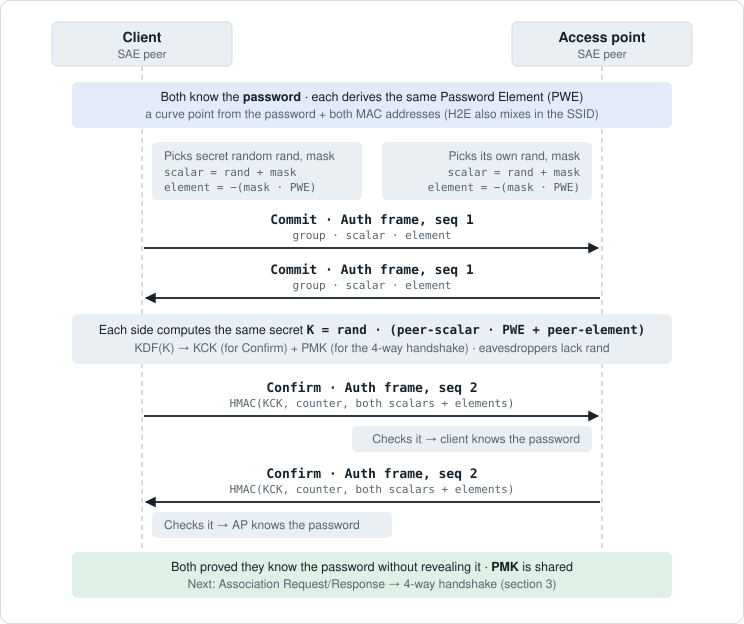

*SAE runs inside 802.11 Authentication frames, before association. The two Commits can cross in flight: neither side waits for the other, which is the "simultaneous" in the name. A wrong password produces a different K, so the Confirm check fails and the attempt is rejected.*

| Frame | Carries | What it does |
|---|---|---|
| **Commit** (Auth seq 1) | Group (e.g. 19 = NIST P-256), scalar, element | Each side commits to a secret random value tied to the password element (PWE), without revealing either |
| **Confirm** (Auth seq 2) | Send-confirm counter, HMAC over both sides' scalars and elements | Proves the sender derived the same K, which is only possible with the right password |

- **Resists offline dictionary attacks:** captured frames are useless for guessing. Every guess needs a live exchange with the AP, which can rate-limit.
- **Forward secrecy:** learning the password later doesn't decrypt previously captured traffic.
- **Anti-clogging:** each Commit costs the AP expensive elliptic-curve math, so under a flood the AP answers with a token that the client must echo back in a new Commit before the AP does any work.
- **Dragonblood (2019)** found side-channel and downgrade flaws; the fix is **Hash-to-Element (H2E)**, which is required on 6 GHz.

#### WPA3-Enterprise

- Same 802.1X/EAP model as WPA2-Enterprise, but with PMF required and server certificate validation expected.
- **192-bit mode** (CNSA suite) for government/high-security: GCMP-256 encryption, HMAC-SHA-384, ECDH/ECDSA on P-384, EAP-TLS.

#### Also part of the WPA3 era

- **PMF (802.11w, Protected Management Frames):** mandatory. Deauth and disassociation frames are integrity-protected, so they can't be spoofed.
- **Transition mode:** WPA2-PSK and WPA3-SAE on the same SSID for mixed clients. Convenient, but an attacker can lure WPA3-capable clients down to WPA2. *Transition Disable* tells clients to stop accepting WPA2 once they've seen WPA3 for that network. Not allowed on 6 GHz. See [how a client chooses](#how-a-client-chooses-wpa2-vs-wpa3) below.
- **Wi-Fi Enhanced Open (OWE):** encryption for password-less networks (cafés, guest Wi-Fi) using a Diffie-Hellman exchange during association. Stops passive sniffing, but *does not authenticate the AP* — evil twins still work.
- **Wi-Fi Easy Connect (DPP):** onboard headless/IoT devices by scanning a QR code instead of typing a password.
- **Wi-Fi 7** adds a new SAE variant (SAE-EXT-KEY) and GCMP-256 for multi-link operation.

### How a client chooses WPA2 vs WPA3

There's no algorithm that keeps switching a client between WPA2 and WPA3. The choice is made **once per association**: the AP advertises what it supports, and the client picks.

1. **AP advertises its options** — `Beacon` · `Probe Response` · `RSNE`\
   The RSN Information Element lists the **AKMs** (authentication and key management suites) the network accepts, plus two PMF flags: *capable* (MFPC) and *required* (MFPR).
2. **Client picks**\
   It compares that list with its saved profile for the SSID (security type + credential) and chooses the strongest AKM both support, so SAE is chosen over PSK.
3. **Client states its choice** — `Authentication (SAE)` · `Association Request · RSNE`\
   For WPA3 it runs SAE in the Authentication frames, then names the chosen AKM and cipher in its own RSNE in the Association Request.

| AKM | Meaning |
|---|---|
| 2 | PSK — WPA2-Personal |
| 8 | SAE — WPA3-Personal |
| 1 / 5 | 802.1X — Enterprise (5 = SHA-256 variant) |
| 4 / 9 | FT-PSK / FT-SAE — the fast-roaming (802.11r) versions |

#### Transition mode: where the choice matters

A transition-mode SSID advertises **both AKM 2 (PSK) and AKM 8 (SAE)**, with PMF capable but not required. Each client decides on its own:

- A WPA3-capable phone sees SAE and uses it, with PMF.
- An older laptop only understands PSK and connects with WPA2.

Both use the same SSID and password. It can look like the network is "switching" security, but it's really each client choosing separately.

> [!CAUTION]
> **Downgrade attack.** Because the client picks from whatever the AP advertises, an attacker can run a fake AP with the same SSID that offers **only WPA2**. A transition-mode client connects with PSK and sends M2, which is enough to crack the password offline. This is the downgrade part of Dragonblood (2019).

#### Downgrade protections

- **RSNE check in M3:** the AP repeats its RSNE in message 3 and the client compares it with the beacon. This catches a tampered beacon from the real AP, but not a fake AP, which never gets as far as a valid M3.
- **Transition Disable:** once a client connects with WPA3, the real AP tells it in M3 to stop accepting WPA2 for that network. The client updates its saved profile, so a later WPA2-only fake AP is refused.

#### Other things that affect the choice

- **Operating systems** mostly key a saved network on SSID + security type. Most current OSes upgrade a saved WPA2 network to WPA3 when the AP offers both, and some warn about "weak security" on WPA2-only networks.
- **Roaming** normally keeps the same AKM. Fast roaming (802.11r) needs matching kinds on both APs (FT-SAE to FT-SAE, FT-PSK to FT-PSK). Mixed setups can force a full re-authentication or a quiet fallback to WPA2.
- **6 GHz has no choice:** transition mode isn't allowed there. A common setup is transition mode on 2.4/5 GHz and WPA3-only on 6 GHz for the same SSID.

### Beyond encryption

- **Disable WPS.** The 8-digit PIN method can be brute-forced in hours because it's checked in two halves.
- **Hidden SSIDs and MAC filtering are not security.** The SSID still appears in probe and association frames, and MAC addresses are sent in clear text and trivially spoofed.
- **Segment:** put guest and IoT networks on separate VLANs with client isolation.
- **Monitor:** a WIPS (wireless intrusion prevention system) detects rogue APs, evil twins and deauth floods.
- **Patch:** KRACK, FragAttacks (2021) and Dragonblood were all fixed in firmware.

---

## 6. Fast roaming with 802.11r

A **roam** is a client moving its connection from one AP to another in the same network (same SSID, same ESS). The **client alone decides when to roam**, usually when the current AP's signal or SNR drops below its threshold. The network can only suggest a move or kick the client off.

The problem is time. Voice and video want the whole roam done in roughly **50 ms or less**. A full WPA2/WPA3-Enterprise roam repeats everything from section 4: 802.11 authentication, reassociation, a full EAP exchange with the RADIUS server (several round trips, possibly to another site), then the 4-way handshake. That can take hundreds of milliseconds, and the call drops audio in the meantime.

### Roaming methods compared

| Method | What it skips | Still needed after reassociation | Notes |
|---|---|---|---|
| **Full re-authentication** | Nothing | EAP + 4-way handshake | Slowest; every roam goes back to RADIUS. |
| **PMK caching** | EAP, but only on APs the client has used before | 4-way handshake | Part of 802.11i. Doesn't help on the first visit to an AP. |
| **OKC** (Opportunistic Key Caching) | EAP on any AP that shares the cache (usually via a controller) | 4-way handshake | Widely supported, but a vendor extension, not part of 802.11. |
| **802.11r (FT)** (Fast BSS Transition) | EAP *and* the separate 4-way handshake | Nothing: keys are ready when reassociation completes | IEEE standard (2008). The whole roam is **4 frames**. |

### The FT key hierarchy

Normal WPA2/WPA3 has one PMK per client. 802.11r splits it into levels so a key can be *derived* for each AP instead of re-running EAP. The APs that share this hierarchy form a **mobility domain**, identified by a **Mobility Domain ID (MDID)** that APs advertise in the Mobility Domain Element (MDE) of their beacons.

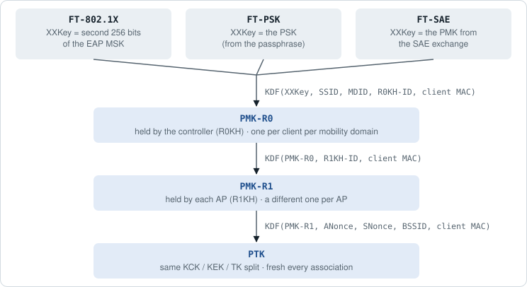

Because each AP only ever holds its own PMK-R1, a compromised AP can't derive the keys for other APs.

### First connection: Initial Mobility Domain Association

The first time a client joins any AP in the mobility domain, there is nothing to shortcut yet. It connects the normal way, with two differences:

- The Association Request and Response carry the **MDE** and the **Fast BSS Transition Element (FTE)**, and the client picks an FT AKM (e.g. FT-802.1X).
- After full EAP (enterprise) or SAE, the **4-way handshake** also carries the MDE, FTE and key names. This sets up PMK-R0 on the controller and PMK-R1 on the first AP.

From then on, every roam within the mobility domain uses the fast path.

### The fast roam: FT over the air

The client talks directly to the target AP. The four frames that would normally just be Authentication and Reassociation now also carry the nonces and MICs that the 4-way handshake used to carry.

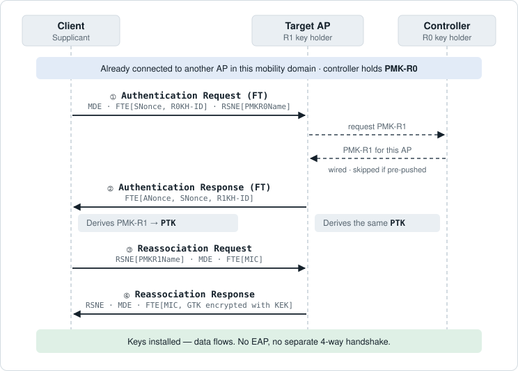

*Frames ① and ② do the job of 4-way messages 1–2 (exchanging nonces). Frames ③ and ④ do the job of messages 3–4 (proving both sides have the key with a MIC, and delivering the GTK). Many controllers push PMK-R1 to neighbouring APs in advance, so the wired fetch often isn't needed during the roam.*

#### Over the air vs. over the DS

| | FT over the air | FT over the DS |
|---|---|---|
| **How** | Client sends FT Authentication frames directly to the target AP | Client sends `FT Action` frames to its *current* AP, which forwards them over the wired network (the distribution system) to the target AP |
| **Then** | Reassociates with the target AP | Reassociates with the target AP |
| **Why use it** | Simple; the usual default | Pre-authenticates while still on a good link to the current AP |
| **Downside** | The exchange starts only once the client has decided to move | Depends on the current AP and the wired path; inconsistent client support |

### Deploying 802.11r

- **FT AKMs:** 3 = FT-802.1X, 4 = FT-PSK, 9 = FT-SAE (13 = FT-802.1X with SHA-384). These appear in the RSNE alongside or instead of the regular AKMs (1, 2, 8).
- **All APs in the mobility domain** need the same SSID, the same MDID and the same security settings, plus a way to share keys (normally a controller or the vendor's cloud).
- **Mixed / adaptive mode:** advertises both the FT and non-FT AKM (e.g. 1 and 3) so FT-capable clients use FT and others connect normally.
- **FT-PSK still has the PSK weakness.** 802.11r speeds up the roam but doesn't fix offline password cracking. That's still WPA3/SAE's job.
- **KRACK (2017)** also hit the FT handshake: replaying the Reassociation Request could reinstall keys. Fixed by patches.

> [!WARNING]
> **Common trap:** some older clients mishandle the extra FT elements in beacons and fail to connect, or can't even see the SSID, when FT is turned on. That's why mixed/adaptive mode exists, and why some networks put FT on a separate voice SSID.

### The r / k / v trio

| Amendment | Answers | What it does |
|---|---|---|
| `802.11k` | *Where* should I look? | Radio Resource Measurement: the AP gives the client a **neighbor report** (nearby APs and their channels), so the client scans only those channels instead of all of them. |
| `802.11v` | *When / to which AP* should I go? | BSS Transition Management: the AP can **suggest** a better AP (for load balancing, band steering, or before shutting down). The client may refuse. |
| `802.11r` | *How* do I move fast? | Fast BSS Transition: completes authentication and key setup in 4 frames. |

> [!TIP]
> k finds the next AP, v nudges the client toward it, and r makes the move fast. The client still makes the final decision. The Wi-Fi Alliance's **Voice-Enterprise** certification requires all three.

---

## 7. Numbers to memorize

| Number | Meaning |
|---|---|
| 🟧 **1 · 6 · 11** | Non-overlapping 2.4 GHz channels (US) |
| 🟦 **25** | Non-overlapping 20 MHz channels in 5 GHz (US, incl. DFS) |
| 🟪 **59** | 20 MHz channels in 6 GHz (1200 MHz of spectrum) |
| **60 s** | DFS Channel Availability Check before transmitting |
| **102.4 ms** | Default beacon interval (100 TU) |
| **16 µs · 9 µs · 34 µs** | SIFS, slot time and DIFS (OFDM, 5 GHz) |
| **15 → 1023** | Contention window, doubling after each failed attempt |
| **±3 dB** | Double / halve the power |
| **6 dB** | Extra path loss each time distance doubles |
| **20 dBm** | = 100 mW (0 dBm = 1 mW) |
| **−67 dBm** | Signal design target for voice and video |
| **60%** | Minimum clear first Fresnel zone on a point-to-point link |
| **8–63** | Characters in a WPA2/WPA3 passphrase |
| **4096** | PBKDF2 iterations turning a WPA2 passphrase into the PMK |

---

## 8. Self-test

Answer out loud before you expand each one.

<details><summary><b>Q1.</b> Which 2.4 GHz channels don't overlap in the US, and why only those?</summary>

1, 6 and 11. Channels are 5 MHz apart but ~20–22 MHz wide, so you need a gap of 5 channel numbers to avoid overlap, and only three fit in 1–11.
</details>

<details><summary><b>Q2.</b> Which 5 GHz sub-bands require DFS, and what does DFS protect?</summary>

U-NII-2A (ch 52–64) and U-NII-2C (ch 100–144). DFS protects radar (weather, military): the AP must check for radar for 60 s before using the channel and move off it if radar appears.
</details>

<details><summary><b>Q3.</b> What security options are allowed on 6 GHz?</summary>

WPA3 (SAE with H2E, or WPA3-Enterprise) or Enhanced Open (OWE), all with PMF. No WPA2, no open networks, no transition mode.
</details>

<details><summary><b>Q4.</b> Name two ways a client can discover a 6 GHz AP.</summary>

A Reduced Neighbor Report in the AP's 2.4/5 GHz beacons, or scanning the 15 Preferred Scanning Channels (PSCs).
</details>

<details><summary><b>Q5.</b> You double the distance from the AP. How much signal do you lose in free space?</summary>

About 6 dB (one quarter of the power).
</details>

<details><summary><b>Q6.</b> A signal goes from 50 mW to 100 mW. How many dB is that? What is 100 mW in dBm?</summary>

+3 dB (doubling). 100 mW = 20 dBm.
</details>

<details><summary><b>Q7.</b> Which RF behaviour is the main cause of multipath, and how did 802.11n turn multipath into an advantage?</summary>

Reflection. 802.11n's MIMO sends independent spatial streams over the different paths.
</details>

<details><summary><b>Q8.</b> Signals are much weaker through a crowd of people. Which behaviour is that?</summary>

Absorption. Bodies are mostly water, which turns RF energy into heat.
</details>

<details><summary><b>Q9.</b> Put in order: 4-way handshake, association, probe, 802.1X/EAP, 802.11 authentication.</summary>

Probe → 802.11 authentication → association → 802.1X/EAP (enterprise only) → 4-way handshake.
</details>

<details><summary><b>Q10.</b> What does M1 carry, and why has it no MIC?</summary>

The ANonce (plus a replay counter). The client can't have a PTK yet, so there's no KCK to compute a MIC with.
</details>

<details><summary><b>Q11.</b> What five inputs produce the PTK?</summary>

PMK, ANonce, SNonce, the AP's MAC and the client's MAC.
</details>

<details><summary><b>Q12.</b> Which key encrypts the GTK in message 3? Which encrypts unicast data?</summary>

The KEK encrypts the GTK. The TK encrypts unicast data.
</details>

<details><summary><b>Q13.</b> Why can WPA2-Personal passwords be cracked offline?</summary>

M1 + M2 (or the PMKID) contain the nonces, MACs and a MIC. An attacker guesses a passphrase, derives PMK → PTK, and checks if the MIC matches, without ever talking to the AP again.
</details>

<details><summary><b>Q14.</b> What replaces the PSK in WPA3-Personal, and what two properties does it add?</summary>

SAE (Simultaneous Authentication of Equals). It adds resistance to offline dictionary attacks and forward secrecy.
</details>

<details><summary><b>Q15.</b> What does PMF (802.11w) protect against?</summary>

Spoofed deauthentication and disassociation frames, used to kick clients off or force them to reconnect so an attacker can capture a handshake.
</details>

<details><summary><b>Q16.</b> A café wants encryption without a password. What should it use, and what doesn't it protect against?</summary>

Wi-Fi Enhanced Open (OWE). It encrypts each client's traffic but doesn't authenticate the AP, so an evil twin is still possible.
</details>

<details><summary><b>Q17.</b> Which EAP method needs certificates on both client and server?</summary>

EAP-TLS. PEAP and EAP-TTLS need only a server certificate.
</details>

<details><summary><b>Q18.</b> Why aren't a hidden SSID and MAC filtering real security?</summary>

The SSID still appears in probe and association frames, and MAC addresses are sent in clear text and easy to spoof.
</details>

<details><summary><b>Q19.</b> How does a client tell which security methods an AP supports, and where does it state its choice?</summary>

The AKMs listed in the RSN Information Element of Beacons and Probe Responses. The client names its chosen AKM in the RSNE of its Association Request, after running SAE in the Authentication frames if it chose WPA3.
</details>

<details><summary><b>Q20.</b> In WPA2/WPA3 transition mode, how does an attacker force a downgrade, and which feature stops it?</summary>

A fake AP with the same SSID advertises only PSK, so the client connects with WPA2 and hands over M2 for offline cracking. Transition Disable stops it: after one WPA3 connection, the real AP tells the client to stop accepting WPA2 for that network.
</details>

<details><summary><b>Q21.</b> What two steps of a normal enterprise roam does 802.11r eliminate, and how many frames does an FT roam take?</summary>

The full EAP exchange with RADIUS and the separate 4-way handshake. An FT roam takes 4 frames: FT Authentication Request/Response and Reassociation Request/Response.
</details>

<details><summary><b>Q22.</b> Which device holds PMK-R0 and which holds PMK-R1?</summary>

PMK-R0 is held by the R0 key holder, usually the controller (one per client per mobility domain). PMK-R1 is held by each AP, the R1 key holder, with a different one for each AP.
</details>

<details><summary><b>Q23.</b> What's the difference between FT over the air and FT over the DS?</summary>

Over the air, the client sends FT Authentication frames directly to the target AP. Over the DS, it sends FT Action frames to its current AP, which forwards them across the wired network to the target. Both finish with a reassociation to the target AP.
</details>

<details><summary><b>Q24.</b> Match 802.11k, 802.11v and 802.11r to what each does for roaming.</summary>

k: neighbor reports tell the client where to scan. v: BSS Transition Management lets the AP suggest a better AP. r: Fast BSS Transition makes the key exchange fast.
</details>

<details><summary><b>Q25.</b> A network uses FT-PSK. Is it protected against offline password cracking?</summary>

No. 802.11r only speeds up the roam; the PSK is still the root key. Use FT-SAE (WPA3) or FT-802.1X for that protection.
</details>

<details><summary><b>Q26.</b> What do the SAE Commit and Confirm frames each carry, and why can't an eavesdropper who captures them test password guesses offline?</summary>

Commit carries a scalar and an element, built from a secret random value and the password element. Confirm carries an HMAC, keyed with the KCK derived from the shared secret K, over both sides' scalars and elements. Testing a guess would need a side's secret random value (`rand`), which never leaves the device, so each guess requires a new live exchange with the AP.
</details>

<details><summary><b>Q27.</b> In an 802.1X login, which protocol carries EAP between the client and the AP, and which carries it between the AP and the authentication server?</summary>

EAPOL (EAP over LAN, 802.1X frames) over the air between client and AP; RADIUS on the wired side between AP and server. The AP only relays EAP between the two.
</details>

<details><summary><b>Q28.</b> In PEAP, why can the first Identity response say "anonymous", and how does the AP end up with the MSK?</summary>

The first (outer) identity is sent before the TLS tunnel exists, so it's visible to anyone. It only needs a realm to route the request; the real username is sent later inside the tunnel. The RADIUS server sends the MSK to the AP in the Access-Accept (MS-MPPE key attributes). The client derives the same MSK itself from the TLS session.
</details>

<details><summary><b>Q29.</b> Name the three 802.11 frame types and give two examples of each.</summary>

Management (Beacon, Probe Request, Authentication, Association Request, Deauthentication, Action), control (ACK, RTS, CTS, Block Ack, PS-Poll) and data (Data, QoS Data, Null).
</details>

<details><summary><b>Q30.</b> A laptop sends a frame to a server on the wired LAN. What are the To DS / From DS bits, and what's in Addresses 1, 2 and 3?</summary>

To DS = 1, From DS = 0. Address 1 = the AP's BSSID (receiver), Address 2 = the laptop's MAC (transmitter), Address 3 = the server's MAC (final destination).
</details>

<details><summary><b>Q31.</b> Why does Wi-Fi use CSMA/CA instead of Ethernet's CSMA/CD?</summary>

A radio is half duplex: it can't listen while transmitting, so it can't detect a collision. Hidden nodes mean collisions can also happen at the receiver, out of the sender's hearing. So Wi-Fi avoids collisions (carrier sense, interframe spaces, random backoff) and uses ACKs to find out whether a frame got through.
</details>

<details><summary><b>Q32.</b> What is the NAV, and what sets it?</summary>

The network allocation vector: a timer for virtual carrier sense. A station sets it from the Duration field of frames it overhears (including RTS and CTS) and treats the medium as busy until it expires.
</details>

<details><summary><b>Q33.</b> Why is SIFS shorter than DIFS, and what happens to the contention window after a missed ACK?</summary>

SIFS is used for frames that complete an exchange in progress (ACK, CTS, Block Ack), so they always go before any station waiting DIFS can start a new transmission. After a missed ACK, the sender doubles its contention window (up to CWmax, 1023) and retries.
</details>

<details><summary><b>Q34.</b> Two clients reach the AP but not each other, and their frames keep colliding. What's this called, and how does RTS/CTS fix it?</summary>

The hidden node problem. The sender's RTS and the AP's CTS both carry a Duration; the hidden client can't hear the RTS but does hear the AP's CTS, so it sets its NAV and stays quiet for the whole exchange.
</details>

<details><summary><b>Q35.</b> Which WMM access category gets the shortest AIFS and smallest contention window? Does WMM guarantee its bandwidth?</summary>

Voice (AC_VO): AIFSN 2 and CW 3–7. No. WMM only improves the odds of winning the medium; it doesn't reserve bandwidth.
</details>

---

*Channel counts reflect US (FCC) rules unless noted. Other regions differ; check your exam's region assumptions.*
